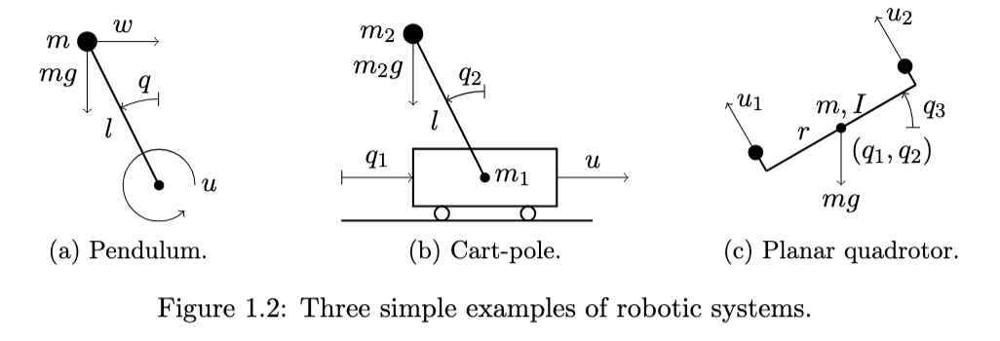

# Robotic Systems
collapsed:: true
	- 
	- A system composed of
		- an open chain of rigid bodies (link)
		- connected by revolute (rotation) or prismatic (translation) joints
	- Pendulum - 1 input which is Torque
	- Cart - Pole - 1 input which is the force on the cart
	- Planar Quadrotor -
		- Is an atypical robotic system where it's (x,y) are seen as being controlled by 2 massless rigid body e.g. massless gantry - this is how the quadrotor moves around in space
- # Manipulator Equations
  collapsed:: true
	- $$\textbf{M}(q(t)) \ddot q(t) + \textbf{C}(q(t), \dot q(t))\dot q(t) + \textbf{n}(q(t), \dot q(t)) = \textbf{D}(q(t))u(t)$$
	- $\textbf{M}$ is a mass matrix. It is always Positive Definite, hence it invertible
	- $\textbf{C}(q, \dot q)\dot q$ are Coriolis and centrifugal *forces* these aren't forces in the physical sense
		- "Apparent forces are fake forces until they break your clutch" :)
	- $\textbf{n}(q(t), \dot q(t))$ is a gravity term as these terms generally arise from counteracting gravitational effects.
	- ## Coming back the dynamics world
		- In order convert the manipulator equation into a dynamical system we first do the following
		- $$ \textbf{M}(q(t)) \ddot q(t) + \textbf{c}(q(t), \dot q(t)) = \textbf{D}(q(t))u(t)\\ \text{where, }\textbf{c}(q(t), \dot q(t)) = \textbf{C}(q(t), \dot q(t))\dot q(t) + \textbf{n}(q(t), \dot q(t))$$
		- We then define a state vector $x(t) = [q(t)\ \dot q(t) ]^T = [x_1(t)\ x_2(t) ]^T$
		- Then we get the following: $$\dot x(t) = [\dot x_1\ \textbf{M}^{-1}(x(t))(\textbf{D}(x_1(t))u(t)- \textbf{c}(x_1(t), x_2(t)))]^T$$
- # Discrete Time Systems
  collapsed:: true
	- The discrete time analogous to the continuous time system is
	- $$x(k+1) = f(x(k),u(k));\ x(0) = 0$$
	- where $k \in \mathbb{Z}$
	- The equilibrium state, $x^\ast$: $f(x^\ast(k), 0) = x^\ast(k)$
	- The solution to the discrete time system: $\phi(k; x_0, u)$
		- Uniqueness and existness aren't questioned in the discrete case as long as the function $$f(x, u)$$ is a well-defined function
	- In continuous time, the state is continuous i.e. there infinitely many states that solve the system, similarly in discrete time, the state can be discrete i.e. the states can be finite.
	- ## Continuous -> Discrete
		- $$\dot x(t) = f(x, u)$$
		- To discretize this, let $$h>0$$ such that
		- $$\dot x(t) \approx \frac{x(t+h) - x(t)}{h}\\x(t+h) \approx x(t) + hf(x, u)$$
		- Now, we substitute $$t = kh$$ and also define $$\tilde x(k) = x(kh); \tilde u(k)=u(kh); \tilde f(x,u) = x+hf(x,u)$$
		- $$\tilde x(k+1) = \tilde f(\tilde x, \tilde u)$$
		- In this method, the choice of approximation of the derivative
			- For example, we could choose to discretize the derivative as $$\dot x(t) \approx \frac{x(t) - x(t-h)}{h}$$
- # Control Problems
	- $$\dot x(t) = f(x, u);\ x(0) =0$$
	- Given a finite time horizon $T>0$ and a target set $\mathcal{T} \subseteq \mathbb{R}^n$
	- Goal is to design $u: [0,T] \rightarrow \mathbb{R}^n$ such that $\phi(T; x_0, u) = \mathcal{T}$
	- We can also have transient constraints $$[\phi(t; x_0, u)\ u(t)] \in \mathcal{C} \subseteq \mathbb{R}^n;\ \forall t \in T$$ which translate to physical impossibilites that the system cannot achieve
	- **Variants**
		- Time invariant & Time variant systems
		- Continuous time vs Discrete time
		- Free final time vs Fixed final time
		- Inf time horizon vs Finite time horizon
		- Disturbances can accounted for in the transient constraints
	- ## Closed Loop Problem
	- Design a policy $$\pi (t): \mathbb{R}^n \times [0,T] \rightarrow \mathbb{R}$$ such that the control input $$u(t) = \pi (x(t), t)$$
	- ## Swing up pendulum
		- ## Open Loop
		- $$ml^2 \ddot q(t) - mgl\sin (q(t)) = u(t)$$
		- CHECK NOTES AND TRY TO UNDERSTAND WHAT $r(t)$ is
		- Closed Loop is [[HOMEWORKS]]
	- ## Flight of Quadrotor
		- Differential Flatness -
		-