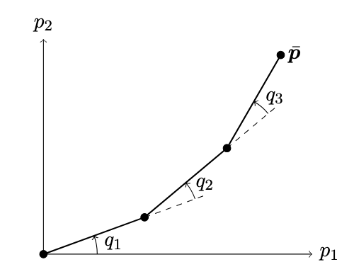

-
	- For the pendulum control policy, we can add the negative of the non-linearity into the control policy such that the final expression becomes a linear differential equation. $$u(t) = -e(t)-\dot e(t)-mgl\sin(q_0(t)$$
	- For the quadrotor's trajectory:
		- We normalize the time i.e. q_{1/2}(t/T) such that the trajectory is agnostic to the time horizon.
		- The trajectory of $q_2(t)$ can be something really simple whose first, second and third derivatives go to zero. So it could just be the smooth step function, for example.
- # Continuous Optimization
- Inverse kinematics (IK) of a planar robot with 3 joints such as below
- 
	- ## IK for an n-link robot
	- The final position $$bar p$$ of the end effector given all the n joint angles $$\bar q$$
	- $$\bar p (\bar q) =  \begin{bmatrix} \sum\limits_{1 \leq i \leq n} l_i\cos\Big(\sum\limits_{1 \leq j \leq i}q_j\Big)\\\sum\limits_{1 \leq i \leq n} l_i \sin\Big(\sum\limits_{1 \leq j \leq i}q_j\Big)\end{bmatrix}$$
	- If $$n \geq 3$$, then there infinitely many solution to the find position i.e. that there are infinite joint configurations that place the end effector at the desired location.
	- [[Singular configurations]] is why need an optimization
	- One possible constraint is that we don't want the joints to completely
- # Discrete-Continuous Optimization
	- $$\mathcal{S} = \mathcal{S}_1 \times \mathcal{S}_2$$ where $$\mathcal{S}_1$$ is finite and/or countable and $$\mathcal{S}_2$$ is uncountable.
	- > This is a weird definition because the cartesian product makes the final set uncountable
- # Optima
	- ## What are they
	- $\hat x \in \mathbb{R}^n$ is a feasible solution if $\hat x \in \mathcal{S}$.  It is just a solution that obeys the constraints
	- $x^\ast \in \mathbb{R}^n$ is the global optima if:
		- $x^\ast \in \mathcal{S}$
		  logseq.order-list-type:: number
		- $f(x^\ast) \leq f(x),\ \forall x \in \mathcal{S}$
		  logseq.order-list-type:: number
	- $\tilde x \in \mathbb{R}^n$ is the local optima if:
		- $\tilde x \in \mathcal{S}$
		  logseq.order-list-type:: number
		- $\exists \epsilon > 0 \text{ s.t., } f(\tilde x) \leq f(x),\ \set{x: \mid x-\tilde x\mid \leq \epsilon}$
		  logseq.order-list-type:: number
	- Optimal value: $f^\ast = f(x^\ast)$
	- > Note: If we have multiple global optimas, then their optimal values are necessarily equal.
	- ## When do they exist
	- At least one optimum $x^\ast$ exists if $\mathcal{S}$ is compact and $f$ is continuous
	- Interestingly, an optimum also exists if a sequence in $\set{x_n}_{n=1} \in \mathcal{S}$ is unbounded