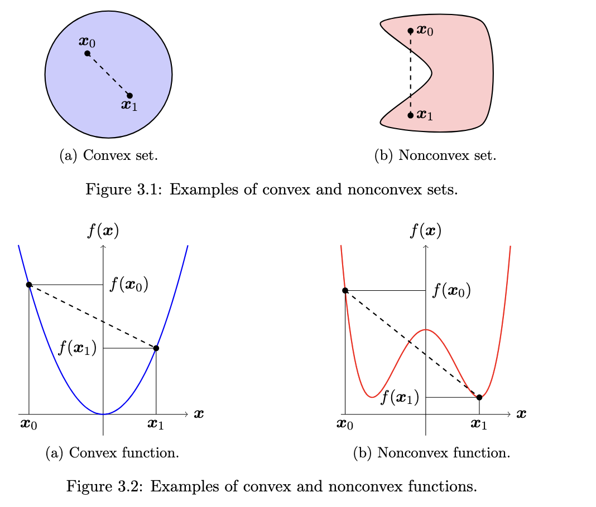

# Convex Optimization
	- Convex Combination: $\theta x_0 + (1-\theta)x_1; \text{ where } \theta \in [0,1]$ is a convex combination of $x_0,x_1$
	- {:height 522, :width 603}
	- Convex Set: $\mathcal{S}$ is convex if $\theta x_0 + (1-\theta)x_1 \in \mathcal{S} \forall x_0,x_1 \in \mathcal{S}$
	- A convex function $f: \mathbb{R}^n \rightarrow \mathbb{R}$ is such that
	- $$f(\theta x_0 + (1-\theta)x_1) \leq \theta f(x_0) + (1-\theta)f(x_1) $$
	- > Negative of a convex function is a concave function
	- Epigraph for a function $f: \mathbb{R}^n \rightarrow \mathbb{R}$
	- $$\mathcal{E}= \set{(\bar x,y) \in \mathbb{R}^{n+1}: f(\bar x)\leq y}$$
	- A function is convex iff its epigraph is convex
		- Proof Sketch: if $(\bar x_0, y_0), (\bar x_1, y_1) \in \mathcal{E}$
		- $\implies ((1-\theta) \bar x_0 + \theta \bar x_1 , (1-\theta)y_0+ \theta y_1)$
		- $\implies f((1-\theta) \bar x_0 + \theta \bar x_1) \leq ((1-\theta)y_0+ \theta y_1))$
		- $\implies f((1-\theta) \bar x_0 + \theta \bar x_1) \leq (1-\theta)f(\bar x_0)+ \theta f(\bar x_1)$
		- where in the last line I chose $y_0 = f(\bar x_0)$ and $y_1 = f(\bar x_1)$
		- The other direction is easy to prove as well
	- A function f is also convex iff $f(\bar x_1) \geq f(\bar x_0) + \partial f(\bar x_0) (\bar x_1 - \bar x_0)$ where $\partial f(\cdot)$ is the jacobian of $f$
		- Proof: check the notes
	- A function f is also convex iff $\partial^2 f(\bar x) \succeq 0$ where $\partial^2 f(\cdot)$ is the hessian of $f$
- # Convex Optimization Problem
- Constraint set $\mathcal{S}$ and the objective function $f$ are both convex
- **(IMP)** Any locally optimal solution for a convex problem is also a globally optimal solution
	- Proof Sketch: Assume there exists another solution that better than your locally optimal solution. Now take a convex combination of these two solutions and see if the locally optimal condition still holds.