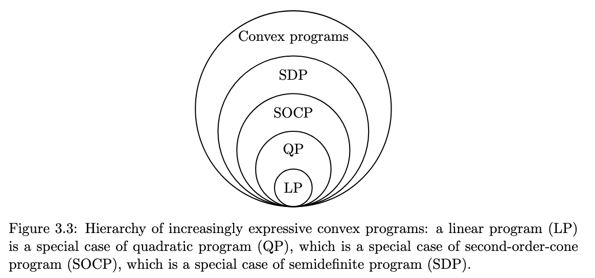

# Cones
	- $\mathcal{K} \subseteq \mathbb{R}$ is a cone if
	- $x \in \mathcal{K} \implies \theta x \in \mathcal{K}; \theta \geq 0$
	- > If a cone is also convex then it is a convex cone. **wooooowww :/**
	- Elementary Cones:
		- *Zero Cone:* $\set{x \in \mathbb{R}: x =0}$ It contains only the origin in 1D
		  logseq.order-list-type:: number
		- *Nonnegative Cone*: $\mathbb{R}_+ = \set{x \in \mathbb{R}: x \geq 0}$
		  logseq.order-list-type:: number
		- *Second Order Cone*: $\mathbb{L}^n = \set{\bar x \in \mathbb{R}^n: x_1 \geq \sqrt{x_2^2 + \cdots + x_n^2}}$ also called the Lorentz Cone
		  logseq.order-list-type:: number
		- *PSD Cone*: $\mathbb{S}_+^n = \set{\mathbf X \in \mathbb{S}^n: \mathbf X \succeq \mathbf 0}$ Set of n-dim square matrices that are also PSD
		  logseq.order-list-type:: number
- # Convexity Preserving Operations
	- **Intersection** of convex sets is convex. **HOLDS for infinite intersections as well**
	- **Cartesian Product** of convex sets is convex
	- If $\mathcal{S} \subseteq \mathbb{R}^n$ is convex then $\set{\mathbf A \bar x + \bar b: \bar x \in \mathcal{S}}$ is convex. More formally, convexity is preserved under an affine mapping. Also, the inverse mapping preserves convexity.... [CHECK]
	- Applying these operations to generate Convex Sets:
		- **Origin and Nonnegative Orthant** -> which is the n times cartesian product of the zero cone and nonnegative cone
		  logseq.order-list-type:: number
		- **Planes and Halfspaces** -> inverse affine mapping of a zero cone gives plane and that of a nonnegative cone gives halfspaces
		  logseq.order-list-type:: number
		- **Affine Subspace and Polyhedra** -> Intersections of planes give Affine subspaces and Polyhedra are intersections of halfspaces
		  logseq.order-list-type:: number
		- **Ellipsoid**: $\mathcal{S} = \set{\bar x \in \mathbb{R}^m: \mid \mathbf A \bar x + \bar b \mid_2 \leq 1}$
		  logseq.order-list-type:: number
		- **Spectrahedra**: Let the function $\mathbf F: \mathbb{R}^m \rightarrow \mathbb{S}^n$, then the preimage of a PSD cone under this affine function is what we call a spectrahedra.
		- $\set{\bar x \in \mathbb{R}^m : \sum\limits_{i=1}^m \mathbf A_i x_i + \mathbf B \succeq \mathbf 0}$
- # Function form of Convex Optimization
	- There are only sufficient but not any necessary conditions to ensure that the function form of a optimization is convex. These sufficient conditions are:
		- $g_i(x) \leq 0$ is convex
		  logseq.order-list-type:: number
		- $h_i(x) = 0 $ is affine
		  logseq.order-list-type:: number
- # Types of Convex Optimization Problems
	- 
	- ## Linear Programs (LP)
		- $$\text{min } \bar c^\top \bar x\\ \text{s.t. } \mathbf A \bar x + \bar b \geq \mathbf 0$$
		- The solution of a linear program is at its extreme value of the polyhedra
	- ## Quadractic Program (QP)
		- $$\text{min } \bar x^\top \mathbf Q \bar x + \bar c^\top \bar x\\ \text{s.t. } \mathbf A \bar x + \bar b \geq \mathbf 0\\ \mathbf Q \succeq \mathbf 0$$
		- The second constraint is because the hessian of the objective is $2\mathbf Q$ which has to be PSD for the objective to be positive
	- ## Second Order Cone Program (SOCP)
		- $$\text{min } \bar c^\top \bar x\\ \text{s.t. } |\mathbf A \bar x + \bar b|_2 \leq \bar c_i^\top \bar x + \bar d_i\ \  \forall i \in \set{1,\cdots, m}$$
		- If $A_i$ and $b_i$ are zero then this is LP
		- We can also prove that this can be used to pose a QP
	- ## Semidefinite Program (SDP)
	- $$\text{min } \bar c^\top \bar x\\ \text{s.t. } \sum\limits_{i=1}^m \mathbf A_i x_i + \mathbf B \succeq \mathbf 0$$
	-