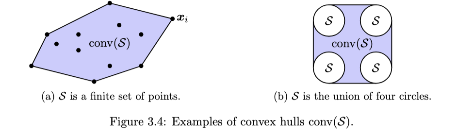

- 
- Let $\set{\bar{x_i}}_{i=1}^m \in \mathbb{R}^n$,
- then their **convex combination** $\bar{x} = \sum\limits_{i}\theta_i \bar x_i$ where $\sum \theta_i = 1, \forall \theta_i \geq 0$
- *Convex Hull* - The convex hull of a given set $\mathcal{S}$ is the set of all convex combinations of every point $\bar x \in \mathcal{S}$
- $$\text{conv}(\mathcal{S}) = \set{\bar x: \bar x = \sum\limits_{i}\theta_i \bar x_i, \sum \theta_i = 1, \forall \theta_i \geq 0, \set{\bar{x_i}}_{i=1}^m \in \mathcal{S}}$$
- This also works if the set is a union of many other sets
- *Extreme Point* - A point $\bar x \in \mathcal{S}$ is an extreme point if it cannot be expressed as a convex combination of two other distinct points
- > $\mathcal{S} = \text{conv}(\mathcal{S})  \text{ when } \mathcal{S}$ is convex
- > Polytopes have finite exterior points
- # Is Convex Optimization always easy
	- This is not always the case. For example, to find that given a polynomial of degree $d$ is non-negative
	- [VIEW THE NOTES]
- # Solving